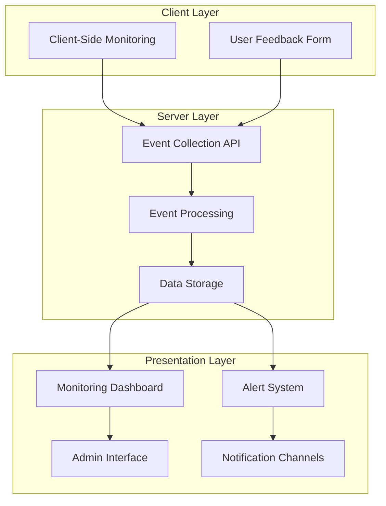

# UI Monitoring and Feedback System Design Document

## Overview

The UI Monitoring and Feedback System is designed to provide comprehensive tracking of UI/UX issues and collect structured user feedback to improve the application. This system will integrate with the existing UI/UX modernization efforts and provide valuable data to guide future improvements.

## Architecture

### System Architecture



### Technical Architecture

The system will be built on the existing Rails application stack:

- **Models**: `UiMonitoringEvent` and `UserFeedback` for data storage
- **Controllers**: API endpoints for event collection and feedback submission
- **Jobs**: Background processing for alerts and notifications
- **Components**: Feedback form component and monitoring dashboard components
- **JavaScript**: Client-side monitoring and event collection

## Components and Interfaces

### 1. Client-Side Monitoring

#### Error Tracking
```javascript
// app/javascript/services/ui_monitoring.js
class UiMonitoringService {
  static captureError(error, componentName = null, context = {}) {
    const eventData = {
      error_type: error.name,
      message: error.message,
      stack: error.stack,
      component_name: componentName,
      context: JSON.stringify(context),
      url: window.location.href,
      user_agent: navigator.userAgent
    };
    
    this.sendEvent('ui_error', eventData);
  }
  
  static sendEvent(eventType, data) {
    fetch('/api/ui_monitoring_events', {
      method: 'POST',
      headers: {
        'Content-Type': 'application/json',
        'X-CSRF-Token': document.querySelector('meta[name="csrf-token"]').content
      },
      body: JSON.stringify({
        event_type: eventType,
        data: data
      })
    }).catch(err => console.error('Failed to send monitoring event:', err));
  }
}

// Global error handler
window.addEventListener('error', (event) => {
  UiMonitoringService.captureError(event.error);
});
```

#### Performance Monitoring
```javascript
// app/javascript/services/performance_monitoring.js
class PerformanceMonitoringService {
  static measureThemeSwitch() {
    const startTime = performance.now();
    
    // Record the start of theme switching
    UiMonitoringService.sendEvent('performance_metric', {
      event_name: 'theme_switch_started',
      timestamp: startTime
    });
    
    // Listen for theme switch completion
    document.addEventListener('theme:switched', () => {
      const duration = performance.now() - startTime;
      
      UiMonitoringService.sendEvent('performance_metric', {
        event_name: 'theme_switched',
        duration: duration,
        metric_name: 'theme_switch_duration',
        value: duration
      });
    });
  }
  
  static measureComponentRender(componentName, callback) {
    const startTime = performance.now();
    
    try {
      const result = callback();
      const duration = performance.now() - startTime;
      
      UiMonitoringService.sendEvent('performance_metric', {
        metric_name: 'component_render_time',
        component_name: componentName,
        value: duration
      });
      
      return result;
    } catch (error) {
      UiMonitoringService.captureError(error, componentName, {
        operation: 'component_render',
        duration: performance.now() - startTime
      });
      throw error;
    }
  }
}
```

### 2. Feedback Form Component

#### Component Design
```ruby
# app/components/feedback_form_component.rb
class FeedbackFormComponent < ViewComponent::Base
  attr_reader :feedback_types
  
  def initialize(current_page:, current_user: nil)
    @current_page = current_page
    @current_user = current_user
    @feedback_types = UserFeedback.feedback_types.keys.map do |type|
      [type.humanize, type]
    end
  end
  
  def current_theme
    helpers.current_theme
  end
  
  def browser_info
    request.user_agent
  end
end
```

#### Component Template
```erb
<!-- app/components/feedback_form_component.html.erb -->
<div class="feedback-form" data-controller="feedback-form">
  <button class="feedback-button" data-action="click->feedback-form#toggleForm">
    <span>Feedback</span>
  </button>
  
  <div class="feedback-panel" data-feedback-form-target="panel">
    <%= form_with model: UserFeedback.new, url: user_feedbacks_path, class: "feedback-form-content" do |f| %>
      <h3 class="feedback-title">Share Your Feedback</h3>
      
      <div class="form-group">
        <%= f.label :feedback_type, "Type of Feedback" %>
        <%= f.select :feedback_type, @feedback_types, { include_blank: "Select a type" }, required: true %>
      </div>
      
      <div class="form-group">
        <%= f.label :message, "Your Feedback" %>
        <%= f.text_area :message, rows: 4, required: true, placeholder: "Please describe your feedback or the issue you're experiencing..." %>
      </div>
      
      <%= f.hidden_field :page, value: @current_page %>
      <%= f.hidden_field :theme, value: current_theme %>
      <%= f.hidden_field :browser, value: browser_info %>
      
      <div class="form-actions">
        <button type="button" class="btn-secondary" data-action="feedback-form#closeForm">Cancel</button>
        <%= f.submit "Submit Feedback", class: "btn-primary" %>
      </div>
    <% end %>
  </div>
</div>
```

#### Stimulus Controller
```javascript
// app/javascript/controllers/feedback_form_controller.js
import { Controller } from "@hotwired/stimulus"

export default class extends Controller {
  static targets = ["panel"]
  
  toggleForm(event) {
    event.preventDefault()
    this.panelTarget.classList.toggle("open")
  }
  
  closeForm() {
    this.panelTarget.classList.remove("open")
  }
  
  connect() {
    // Close form when clicking outside
    document.addEventListener('click', (event) => {
      if (!this.element.contains(event.target) && this.panelTarget.classList.contains("open")) {
        this.closeForm()
      }
    })
  }
}
```

### 3. API Controllers

#### UI Monitoring Events Controller
```ruby
# app/controllers/api/ui_monitoring_events_controller.rb
module Api
  class UiMonitoringEventsController < ApplicationController
    skip_before_action :verify_authenticity_token, only: [:create]
    
    def create
      @event = UiMonitoringEvent.new(event_params)
      @event.user = current_user if user_signed_in?
      @event.session_id = session.id
      @event.ip_address = request.remote_ip
      @event.user_agent = request.user_agent
      
      if @event.save
        process_event(@event)
        render json: { status: 'success', event_id: @event.id }
      else
        render json: { status: 'error', errors: @event.errors.full_messages }, status: :unprocessable_entity
      end
    end
    
    private
    
    def event_params
      params.require(:ui_monitoring_event).permit(:event_type, data: {})
    end
    
    def process_event(event)
      # Check if this event should trigger an alert
      if should_alert?(event)
        UiMonitoringAlertJob.perform_later(event.id)
      end
    end
    
    def should_alert?(event)
      case event.event_type
      when 'ui_error'
        # Alert on critical errors or errors affecting multiple users
        similar_errors = UiMonitoringEvent
          .where(event_type: 'ui_error')
          .where("data->>'error_type' = ?", event.data['error_type'])
          .where('created_at > ?', 1.hour.ago)
          .count
          
        similar_errors >= 3
      when 'performance_metric'
        # Alert on significant performance issues
        event.data['metric_name'] == 'theme_switch_duration' && 
          event.data['value'].to_f > 2000 # More than 2 seconds
      else
        false
      end
    end
  end
end
```

#### User Feedback Controller
```ruby
# app/controllers/user_feedbacks_controller.rb
class UserFeedbacksController < ApplicationController
  def create
    @feedback = UserFeedback.new(feedback_params)
    @feedback.user = current_user if user_signed_in?
    
    if @feedback.save
      flash[:notice] = "Thank you for your feedback!"
      redirect_back(fallback_location: root_path)
    else
      flash[:alert] = "There was a problem submitting your feedback: #{@feedback.errors.full_messages.join(', ')}"
      redirect_back(fallback_location: root_path)
    end
  end
  
  private
  
  def feedback_params
    params.require(:user_feedback).permit(:feedback_type, :message, :page, :browser, :theme)
  end
end
```

### 4. Monitoring Dashboard

#### Dashboard Controller
```ruby
# app/controllers/monitoring_controller.rb
class MonitoringController < ApplicationController
  before_action :require_admin
  
  def index
    @error_summary = UiMonitoringEvent.error_summary
    @performance_metrics = UiMonitoringEvent.performance_metrics_summary
    @theme_switch_performance = UiMonitoringEvent.theme_switch_performance
    @recent_events = UiMonitoringEvent.recent.includes(:user).limit(20)
    
    @feedback_summary = UserFeedback.group(:feedback_type)
                                   .select('feedback_type, COUNT(*) as count, COUNT(CASE WHEN resolved = true THEN 1 END) as resolved_count')
    @recent_feedback = UserFeedback.recent.includes(:user).limit(20)
  end
  
  def events
    @events = UiMonitoringEvent.includes(:user)
    
    # Apply filters
    if params[:event_type].present?
      @events = @events.where(event_type: params[:event_type])
    end
    
    if params[:start_date].present? && params[:end_date].present?
      start_date = Date.parse(params[:start_date])
      end_date = Date.parse(params[:end_date])
      @events = @events.where(created_at: start_date.beginning_of_day..end_date.end_of_day)
    end
    
    @events = @events.order(created_at: :desc).page(params[:page]).per(50)
  end
  
  def feedback
    @feedback = UserFeedback.includes(:user)
    
    # Apply filters
    if params[:feedback_type].present?
      @feedback = @feedback.where(feedback_type: params[:feedback_type])
    end
    
    if params[:resolved].present?
      @feedback = @feedback.where(resolved: params[:resolved] == 'true')
    end
    
    @feedback = @feedback.order(created_at: :desc).page(params[:page]).per(50)
  end
  
  def resolve_feedback
    @feedback = UserFeedback.find(params[:id])
    @feedback.mark_as_resolved(current_user)
    
    redirect_to monitoring_feedback_path, notice: "Feedback marked as resolved"
  end
  
  private
  
  def require_admin
    unless current_user&.admin?
      flash[:alert] = "You are not authorized to access this page"
      redirect_to root_path
    end
  end
end
```

### 5. Alert System

#### Alert Job
```ruby
# app/jobs/ui_monitoring_alert_job.rb
class UiMonitoringAlertJob < ApplicationJob
  queue_as :default
  
  def perform(event_id)
    event = UiMonitoringEvent.find_by(id: event_id)
    return unless event
    
    case event.event_type
    when 'ui_error'
      handle_error_alert(event)
    when 'performance_metric'
      handle_performance_alert(event)
    end
  end
  
  private
  
  def handle_error_alert(event)
    error_type = event.data['error_type']
    component_name = event.data['component_name']
    message = event.data['message']
    
    # Count similar errors
    similar_errors = UiMonitoringEvent
      .where(event_type: 'ui_error')
      .where("data->>'error_type' = ?", error_type)
      .where('created_at > ?', 1.hour.ago)
      .count
    
    alert_message = "UI Error Alert: #{error_type} in #{component_name || 'unknown component'} (#{similar_errors} occurrences in the last hour)\n"
    alert_message += "Message: #{message}\n"
    alert_message += "View details: #{Rails.application.routes.url_helpers.monitoring_events_url(host: ENV['APPLICATION_HOST'])}"
    
    send_alert(alert_message)
  end
  
  def handle_performance_alert(event)
    metric_name = event.data['metric_name']
    value = event.data['value']
    
    alert_message = "Performance Alert: #{metric_name} - #{value}ms\n"
    alert_message += "View details: #{Rails.application.routes.url_helpers.monitoring_events_url(host: ENV['APPLICATION_HOST'])}"
    
    send_alert(alert_message)
  end
  
  def send_alert(message)
    # Send to appropriate channels based on configuration
    # This could be email, Slack, etc.
    if Rails.env.production?
      # In production, send to actual notification channels
      # SlackNotifier.notify(message)
      # EmailNotifier.notify(message)
      Rails.logger.info "ALERT: #{message}" # Placeholder
    else
      # In development, just log the alert
      Rails.logger.info "ALERT: #{message}"
    end
  end
end
```

## Data Models

### UiMonitoringEvent Model

The `UiMonitoringEvent` model has already been defined with the following structure:

```ruby
class UiMonitoringEvent < ApplicationRecord
  # Associations
  belongs_to :user, optional: true

  # Validations
  validates :event_type, presence: true

  # Scopes
  scope :errors, -> { where(event_type: 'ui_error') }
  scope :performance_issues, -> { where(event_type: 'performance_issue') }
  scope :theme_related, -> { where("data->>'event_name' = 'theme_switch_started' OR data->>'event_name' = 'theme_switched' OR data->>'event_name' = 'theme_error'") }
  scope :component_errors, -> { where("data->>'error_type' LIKE 'component%'") }
  scope :recent, -> { order(created_at: :desc).limit(100) }

  # Class methods
  def self.performance_metrics_summary(period = 24.hours)
    where(event_type: 'performance_metric')
      .where('created_at > ?', period.ago)
      .group("data->>'metric_name'")
      .select("data->>'metric_name' as metric_name, AVG((data->>'value')::float) as avg_value, COUNT(*) as count")
  end

  def self.error_summary(period = 24.hours)
    where(event_type: 'ui_error')
      .where('created_at > ?', period.ago)
      .group("data->>'error_type'")
      .select("data->>'error_type' as error_type, COUNT(*) as count")
      .order('count DESC')
  end

  def self.theme_switch_performance(period = 24.hours)
    where("data->>'event_name' = 'theme_switched'")
      .where('created_at > ?', period.ago)
      .select("AVG((data->>'duration')::float) as avg_duration")
      .first&.avg_duration
  end

  # Instance methods
  def error_message
    return nil unless event_type == 'ui_error'
    data['message']
  end

  def component_name
    return nil unless data['context'].present?
    context = JSON.parse(data['context']) rescue {}
    context['componentName']
  end

  def browser_info
    user_agent = data['user_agent'] || ''
    if user_agent.include?('Chrome')
      'Chrome'
    elsif user_agent.include?('Firefox')
      'Firefox'
    elsif user_agent.include?('Safari')
      'Safari'
    elsif user_agent.include?('Edge')
      'Edge'
    else
      'Other'
    end
  end
end
```

### UserFeedback Model

The `UserFeedback` model has already been defined with the following structure:

```ruby
class UserFeedback < ApplicationRecord
  # Associations
  belongs_to :user, optional: true

  # Validations
  validates :feedback_type, presence: true
  validates :message, presence: true
  validates :page, presence: true

  # Enums
  enum feedback_type: {
    bug_report: 'bug_report',
    feature_request: 'feature_request',
    ui_feedback: 'ui_feedback',
    accessibility_issue: 'accessibility_issue',
    performance_issue: 'performance_issue',
    general_feedback: 'general_feedback'
  }

  # Scopes
  scope :recent, -> { order(created_at: :desc) }
  scope :unresolved, -> { where(resolved: false) }
  scope :ui_related, -> { where(feedback_type: ['ui_feedback', 'accessibility_issue']) }
  
  # Instance methods
  def mark_as_resolved(admin_user = nil)
    update(
      resolved: true,
      resolved_at: Time.current,
      resolved_by: admin_user&.id
    )
  end
  
  def summary
    "#{feedback_type.humanize}: #{message.truncate(50)}"
  end
end
```

## Error Handling

### Client-Side Error Handling
```javascript
// Global error boundary for React components (if used)
class ErrorBoundary extends React.Component {
  constructor(props) {
    super(props);
    this.state = { hasError: false };
  }

  static getDerivedStateFromError(error) {
    return { hasError: true };
  }

  componentDidCatch(error, errorInfo) {
    UiMonitoringService.captureError(error, this.props.componentName, errorInfo);
  }

  render() {
    if (this.state.hasError) {
      return this.props.fallback || <div>Something went wrong.</div>;
    }

    return this.props.children;
  }
}

// For Stimulus controllers
const originalControllerConnect = Stimulus.Controller.prototype.connect;
Stimulus.Controller.prototype.connect = function() {
  try {
    originalControllerConnect.apply(this, arguments);
  } catch (error) {
    UiMonitoringService.captureError(error, this.identifier, {
      element: this.element.outerHTML.substring(0, 500)
    });
    throw error;
  }
};
```

### Server-Side Error Handling
```ruby
# app/controllers/application_controller.rb
class ApplicationController < ActionController::Base
  rescue_from StandardError, with: :handle_error
  
  private
  
  def handle_error(exception)
    # Log to UI monitoring if it's a UI-related error
    if ui_related_error?(exception)
      UiMonitoringEvent.create(
        event_type: 'ui_error',
        data: {
          error_type: exception.class.name,
          message: exception.message,
          backtrace: exception.backtrace&.first(10),
          controller: controller_name,
          action: action_name
        },
        user: current_user,
        session_id: session.id,
        ip_address: request.remote_ip,
        user_agent: request.user_agent
      )
    end
    
    # Re-raise for standard error handling
    raise exception
  end
  
  def ui_related_error?(exception)
    # Determine if this is a UI-related error
    exception.is_a?(ActionView::Template::Error) ||
      exception.message.include?('component') ||
      exception.backtrace&.any? { |line| line.include?('/components/') }
  end
end
```

## Testing Strategy

### Unit Testing
```ruby
# test/models/ui_monitoring_event_test.rb
require 'test_helper'

class UiMonitoringEventTest < ActiveSupport::TestCase
  test "should create event with valid attributes" do
    event = UiMonitoringEvent.new(
      event_type: 'ui_error',
      data: { error_type: 'TypeError', message: 'Cannot read property of undefined' }
    )
    assert event.valid?
  end
  
  test "should require event_type" do
    event = UiMonitoringEvent.new(data: { message: 'Test' })
    assert_not event.valid?
    assert_includes event.errors[:event_type], "can't be blank"
  end
  
  test "should find theme related events" do
    UiMonitoringEvent.create(event_type: 'performance_metric', data: { event_name: 'theme_switch_started' })
    UiMonitoringEvent.create(event_type: 'performance_metric', data: { event_name: 'theme_switched' })
    UiMonitoringEvent.create(event_type: 'ui_error', data: { error_type: 'TypeError' })
    
    assert_equal 2, UiMonitoringEvent.theme_related.count
  end
end

# test/models/user_feedback_test.rb
require 'test_helper'

class UserFeedbackTest < ActiveSupport::TestCase
  test "should create feedback with valid attributes" do
    feedback = UserFeedback.new(
      feedback_type: 'bug_report',
      message: 'I found a bug',
      page: '/dashboard'
    )
    assert feedback.valid?
  end
  
  test "should require message" do
    feedback = UserFeedback.new(feedback_type: 'bug_report', page: '/dashboard')
    assert_not feedback.valid?
    assert_includes feedback.errors[:message], "can't be blank"
  end
  
  test "should mark as resolved" do
    feedback = UserFeedback.create(
      feedback_type: 'bug_report',
      message: 'Test bug',
      page: '/dashboard'
    )
    
    assert_not feedback.resolved
    
    feedback.mark_as_resolved
    
    assert feedback.resolved
    assert_not_nil feedback.resolved_at
  end
end
```

### Component Testing
```ruby
# test/components/feedback_form_component_test.rb
require "test_helper"

class FeedbackFormComponentTest < ViewComponent::TestCase
  test "renders feedback form" do
    render_inline(FeedbackFormComponent.new(current_page: "/dashboard"))
    
    assert_selector "form.feedback-form-content"
    assert_selector "select[name='user_feedback[feedback_type]']"
    assert_selector "textarea[name='user_feedback[message]']"
    assert_selector "input[type='hidden'][name='user_feedback[page]'][value='/dashboard']"
  end
  
  test "includes current theme in hidden field" do
    component = FeedbackFormComponent.new(current_page: "/dashboard")
    allow(component).to receive(:current_theme).and_return("dark")
    
    render_inline(component)
    
    assert_selector "input[type='hidden'][name='user_feedback[theme]'][value='dark']"
  end
end
```

### System Testing
```ruby
# test/system/feedback_system_test.rb
require "application_system_test_case"

class FeedbackSystemTest < ApplicationSystemTestCase
  setup do
    @user = users(:regular_user)
    sign_in @user
  end
  
  test "can submit feedback" do
    visit root_path
    
    click_button "Feedback"
    
    within ".feedback-panel" do
      select "Bug Report", from: "Type of Feedback"
      fill_in "Your Feedback", with: "This is a test feedback"
      click_button "Submit Feedback"
    end
    
    assert_text "Thank you for your feedback!"
    
    # Verify the feedback was saved
    feedback = UserFeedback.last
    assert_equal "bug_report", feedback.feedback_type
    assert_equal "This is a test feedback", feedback.message
    assert_equal @user, feedback.user
  end
  
  test "admin can view monitoring dashboard" do
    admin = users(:admin_user)
    sign_in admin
    
    visit monitoring_path
    
    assert_selector "h1", text: "UI Monitoring Dashboard"
    assert_selector ".error-summary"
    assert_selector ".performance-metrics"
    assert_selector ".feedback-summary"
  end
end
```

### JavaScript Testing
```javascript
// test/javascript/ui_monitoring_service_test.js
import { UiMonitoringService } from "services/ui_monitoring";

describe("UiMonitoringService", () => {
  beforeEach(() => {
    global.fetch = jest.fn().mockImplementation(() => 
      Promise.resolve({
        ok: true,
        json: () => Promise.resolve({ status: 'success' })
      })
    );
  });
  
  test("captureError sends error data to server", async () => {
    const error = new Error("Test error");
    error.stack = "Error: Test error\n    at test.js:1:1";
    
    await UiMonitoringService.captureError(error, "TestComponent", { testContext: true });
    
    expect(global.fetch).toHaveBeenCalledWith(
      '/api/ui_monitoring_events',
      expect.objectContaining({
        method: 'POST',
        body: expect.stringContaining('Test error')
      })
    );
  });
});
```

## Implementation Phases

### Phase 1: Core Infrastructure (Week 1)
- Set up database migrations for UiMonitoringEvent and UserFeedback models
- Implement client-side monitoring service
- Create API endpoints for event collection
- Set up basic error tracking

### Phase 2: Feedback System (Week 2)
- Implement FeedbackFormComponent
- Create user feedback controller and views
- Integrate feedback form into application layout
- Test feedback submission flow

### Phase 3: Monitoring Dashboard (Week 3)
- Create monitoring controller and views
- Implement dashboard visualizations
- Add filtering and search functionality
- Set up admin access controls

### Phase 4: Alert System (Week 4)
- Implement alert detection logic
- Create background job for alert processing
- Set up notification channels
- Test alert triggers and delivery

### Phase 5: Integration and Testing (Week 5)
- Integrate with existing error tracking
- Implement comprehensive testing
- Document the system
- Deploy and monitor initial usage

## Design Decisions and Rationales

### 1. Client-Side vs. Server-Side Monitoring
**Decision**: Implement both client-side and server-side monitoring
**Rationale**: Client-side monitoring captures UI issues that don't reach the server, while server-side monitoring provides more context and security

### 2. JSONB Data Storage
**Decision**: Use JSONB for flexible event data storage
**Rationale**: Different event types require different data structures, and JSONB provides flexibility without requiring schema changes

### 3. Background Processing for Alerts
**Decision**: Process alerts in background jobs
**Rationale**: Prevents alert processing from affecting user experience and allows for retries and batching

### 4. User Association with Anonymous Option
**Decision**: Allow both authenticated and anonymous feedback
**Rationale**: Maximizes feedback collection while still enabling user context when available

### 5. Integrated vs. Standalone Dashboard
**Decision**: Integrate monitoring dashboard into the main application
**Rationale**: Simplifies access for administrators and leverages existing authentication system