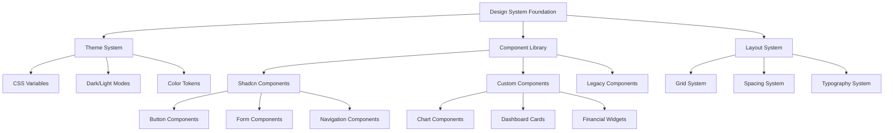

# UI/UX Modernization Design Document

## Overview

This design document outlines the comprehensive approach to modernizing the Maybe finance application's UI/UX. The design focuses on creating a cohesive, accessible, and maintainable design system built on Shadcn principles while preserving existing functionality and improving user experience.

## Architecture

### Design System Architecture



### Technical Architecture

The modernization will be built on the existing Rails + ViewComponent + Tailwind CSS stack:

- **ViewComponent**: Component-based architecture for reusable UI elements
- **Tailwind CSS**: Utility-first CSS framework with custom design tokens
- **Stimulus**: JavaScript behavior for interactive components
- **Lookbook**: Component documentation and development environment

## Components and Interfaces

### 1. Theme System Design

#### CSS Variable Structure
```css
:root {
  /* Semantic color tokens */
  --color-background: hsl(var(--background));
  --color-foreground: hsl(var(--foreground));
  --color-primary: hsl(var(--primary));
  --color-secondary: hsl(var(--secondary));
  --color-muted: hsl(var(--muted));
  --color-accent: hsl(var(--accent));
  --color-destructive: hsl(var(--destructive));
  
  /* Component-specific tokens */
  --color-card: hsl(var(--card));
  --color-border: hsl(var(--border));
  --color-input: hsl(var(--input));
  --color-ring: hsl(var(--ring));
}

[data-theme="dark"] {
  /* Dark mode overrides */
  --background: 224 71% 4%;
  --foreground: 213 31% 91%;
  /* ... other dark mode values */
}
```

#### Theme Implementation Strategy
1. **Audit Phase**: Identify all hardcoded colors in existing codebase
2. **Migration Phase**: Replace hardcoded values with CSS variables
3. **Testing Phase**: Verify theme switching works across all components
4. **Documentation Phase**: Document theme usage patterns

### 2. Component Library Design

#### Core Component Categories

**Base Components** (Shadcn-inspired)
- Button variants (primary, secondary, ghost, destructive)
- Input components (text, select, checkbox, radio)
- Card components with consistent styling
- Modal/Dialog components
- Navigation components

**Financial Components** (Custom)
- Account cards with balance displays
- Transaction list items
- Chart containers with responsive behavior
- Budget progress indicators
- Financial summary widgets

**Layout Components**
- Page containers with consistent spacing
- Grid systems for responsive layouts
- Section dividers and headers
- Sidebar navigation components

#### Component Interface Design

```ruby
# Example: Modern Button Component
class ButtonComponent < ViewComponent::Base
  VARIANTS = {
    primary: "btn-modern-primary",
    secondary: "btn-modern-secondary", 
    ghost: "btn-modern-ghost",
    destructive: "btn-modern-destructive"
  }.freeze
  
  SIZES = {
    sm: "px-3 py-1.5 text-sm",
    md: "px-4 py-2 text-sm",
    lg: "px-6 py-3 text-base"
  }.freeze
  
  def initialize(variant: :primary, size: :md, **options)
    @variant = variant
    @size = size
    @options = options
  end
  
  private
  
  def css_classes
    [
      VARIANTS[@variant],
      SIZES[@size],
      @options[:class]
    ].compact.join(" ")
  end
end
```

### 3. Page Modernization Strategy

#### Dashboard Page Fixes
**Current Issues:**
- White space at bottom due to global `py-6` padding
- Chart container sizing conflicts
- Inconsistent card styling
- Theme switching bugs

**Design Solution:**
```css
/* Page-specific override */
.dashboard-page {
  padding-bottom: 0 !important;
}

/* Chart container standardization */
.chart-container {
  background: var(--color-card);
  border: 1px solid var(--color-border);
  border-radius: var(--radius-xl);
  padding: var(--spacing-6);
  box-shadow: var(--shadow-elevated);
}

/* Consistent card heights */
.dashboard-grid {
  display: grid;
  gap: var(--spacing-8);
  grid-template-columns: repeat(auto-fit, minmax(320px, 1fr));
}
```

#### Page Modernization Priority
1. **Dashboard** (fix existing issues)
2. **Transactions** (high usage, complex interactions)
3. **Budgets** (financial core feature)
4. **Settings** (user preferences)
5. **Other pages** (systematic rollout)

### 4. Responsive Design System

#### Breakpoint Strategy
```css
/* Mobile-first approach */
.responsive-grid {
  display: grid;
  gap: 1rem;
  grid-template-columns: 1fr;
}

@media (min-width: 640px) {
  .responsive-grid {
    grid-template-columns: repeat(2, 1fr);
    gap: 1.5rem;
  }
}

@media (min-width: 1024px) {
  .responsive-grid {
    grid-template-columns: repeat(3, 1fr);
    gap: 2rem;
  }
}
```

#### Touch-Friendly Design
- Minimum 44px touch targets
- Adequate spacing between interactive elements
- Swipe gestures for mobile navigation
- Responsive typography scaling

## Data Models

### Theme Configuration Model
```ruby
class ThemeConfiguration
  include ActiveModel::Model
  
  attr_accessor :mode, :primary_color, :accent_color, :font_size
  
  MODES = %w[light dark system].freeze
  
  def self.for_user(user)
    new(
      mode: user.theme_preference || 'system',
      primary_color: user.primary_color || 'blue',
      accent_color: user.accent_color || 'blue',
      font_size: user.font_size || 'medium'
    )
  end
end
```

### Component Registry Model
```ruby
class ComponentRegistry
  COMPONENTS = {
    'button' => ButtonComponent,
    'card' => CardComponent,
    'input' => InputComponent,
    'modal' => ModalComponent
  }.freeze
  
  def self.render(component_name, **options)
    component_class = COMPONENTS[component_name]
    raise ArgumentError, "Unknown component: #{component_name}" unless component_class
    
    component_class.new(**options)
  end
end
```

## Error Handling

### Theme Fallback Strategy
```css
/* Fallback for unsupported CSS variables */
.fallback-colors {
  background-color: #ffffff; /* fallback */
  background-color: var(--color-background, #ffffff);
  
  color: #000000; /* fallback */
  color: var(--color-foreground, #000000);
}
```

### Component Error Boundaries
```ruby
class ComponentErrorBoundary < ViewComponent::Base
  def initialize(component_name:, fallback_content: nil)
    @component_name = component_name
    @fallback_content = fallback_content
  end
  
  private
  
  def render_with_fallback
    yield
  rescue StandardError => e
    Rails.logger.error "Component error in #{@component_name}: #{e.message}"
    @fallback_content || content_tag(:div, "Component unavailable", class: "text-muted")
  end
end
```

### CSS Conflict Detection
```ruby
class CSSConflictDetector
  def self.detect_conflicts(css_content)
    selectors = extract_selectors(css_content)
    duplicates = selectors.group_by(&:itself).select { |_, v| v.size > 1 }
    
    duplicates.each do |selector, occurrences|
      Rails.logger.warn "Duplicate CSS selector detected: #{selector} (#{occurrences.size} times)"
    end
  end
end
```

## Testing Strategy

### Visual Regression Testing
```ruby
# System test for theme switching
class ThemeSwitchingTest < ApplicationSystemTestCase
  test "dashboard displays correctly in both themes" do
    visit dashboard_path
    
    # Test light theme
    assert_selector ".dashboard-page"
    take_screenshot("dashboard-light")
    
    # Switch to dark theme
    click_button "Toggle theme"
    assert_selector "[data-theme='dark']"
    take_screenshot("dashboard-dark")
    
    # Verify no hardcoded colors are visible
    assert_no_selector ".bg-white", visible: true
    assert_no_selector ".text-black", visible: true
  end
end
```

### Component Testing
```ruby
class ButtonComponentTest < ViewComponent::TestCase
  test "renders with correct variant classes" do
    render_inline(ButtonComponent.new(variant: :primary)) { "Click me" }
    
    assert_selector "button.btn-modern-primary"
    assert_text "Click me"
  end
  
  test "applies theme-aware styling" do
    with_theme(:dark) do
      render_inline(ButtonComponent.new(variant: :primary)) { "Click me" }
      assert_selector "button[data-theme='dark']"
    end
  end
end
```

### Accessibility Testing
```ruby
class AccessibilityTest < ApplicationSystemTestCase
  test "components meet WCAG standards" do
    visit dashboard_path
    
    # Check color contrast
    assert_sufficient_contrast(".btn-primary")
    
    # Check keyboard navigation
    assert_keyboard_navigable("button, a, input, select")
    
    # Check screen reader compatibility
    assert_proper_aria_labels("button[aria-label]")
  end
end
```

### Performance Testing
```ruby
class PerformanceTest < ApplicationSystemTestCase
  test "theme switching is performant" do
    visit dashboard_path
    
    start_time = Time.current
    click_button "Toggle theme"
    end_time = Time.current
    
    assert (end_time - start_time) < 0.5, "Theme switch took too long"
    assert_no_layout_shift
  end
end
```

## Implementation Phases

### Phase 1: Foundation (Weeks 1-2)
- Audit existing CSS for hardcoded colors
- Establish CSS variable system
- Create base component library
- Set up testing infrastructure

### Phase 2: Dashboard Fixes (Week 3)
- Fix white space issues
- Resolve chart container conflicts
- Implement consistent card styling
- Test theme switching

### Phase 3: Core Pages (Weeks 4-6)
- Modernize Transactions page
- Modernize Budgets page
- Modernize Settings page
- Implement responsive design

### Phase 4: Polish & Documentation (Week 7)
- Complete Lookbook documentation
- Performance optimization
- Accessibility audit
- Cross-browser testing

### Phase 5: Rollout (Week 8)
- Systematic rollout to remaining pages
- User acceptance testing
- Bug fixes and refinements
- Final documentation updates

## Design Decisions and Rationales

### 1. CSS Variables vs Tailwind Classes
**Decision**: Use CSS variables for theme tokens, Tailwind classes for layout
**Rationale**: CSS variables provide runtime theme switching, while Tailwind provides consistent spacing and layout utilities

### 2. ViewComponent Architecture
**Decision**: Maintain existing ViewComponent structure
**Rationale**: Already established pattern in codebase, provides good encapsulation and testability

### 3. Gradual Migration Strategy
**Decision**: Page-by-page modernization rather than big-bang approach
**Rationale**: Reduces risk, allows for iterative feedback, maintains application stability

### 4. Shadcn Inspiration vs Direct Implementation
**Decision**: Shadcn-inspired components adapted for Rails
**Rationale**: Maintains Rails conventions while adopting modern design patterns

### 5. Theme System Implementation
**Decision**: CSS custom properties with data attributes
**Rationale**: Provides flexibility, good performance, and easy maintenance