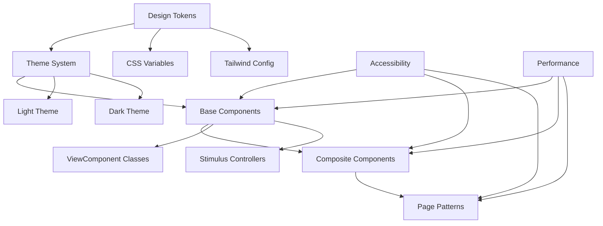

# Maybe Finance Design System

## Introduction

The Maybe Finance Design System is a comprehensive collection of design tokens, components, and patterns that ensure a consistent, accessible, and modern user experience across the application. This documentation serves as the single source of truth for developers working with the UI/UX of Maybe Finance.

## Core Principles

1. **Consistency**: Unified visual language across all pages and components
2. **Accessibility**: WCAG 2.1 AA compliance for all components and patterns
3. **Themability**: Seamless support for light and dark themes
4. **Responsiveness**: Optimal experience across all device sizes
5. **Performance**: Lightweight, efficient components that load quickly
6. **Maintainability**: Clear patterns and documentation for sustainable development

## Documentation Structure

This design system documentation is organized into the following sections:

1. **[Design Tokens](./tokens.md)**: Color, typography, spacing, and other foundational elements
2. **[Theme System](./theme-system.md)**: Implementation of light/dark themes and customization
3. **[Component Library](./components/index.md)**: Documentation for all UI components
4. **[Layout Patterns](./layout-patterns.md)**: Grid systems and common layout structures
5. **[Form Patterns](./form-patterns.md)**: Guidelines for form implementation
6. **[Accessibility Guidelines](./accessibility.md)**: Ensuring all components meet accessibility standards
7. **[Migration Guide](./migration-guide.md)**: How to migrate from legacy to modern components
8. **[Developer Onboarding](./onboarding.md)**: Getting started with the design system
9. **[Implementation Patterns](./implementation-patterns.md)**: Common code patterns and best practices
10. **[Component Status](./component-status.md)**: Current status and roadmap for all components

## Getting Started

For new developers joining the project, we recommend starting with the [Developer Onboarding Guide](./onboarding.md) which provides a step-by-step introduction to working with the design system.

For existing developers looking to migrate components, refer to the [Migration Guide](./migration-guide.md).

## Design System Architecture

The Maybe Finance design system is built on a layered architecture:

## Component Development Workflow

The design system follows a structured workflow for component development:

1. **Research & Requirements**: Identify use cases and requirements
2. **Design & Prototype**: Create initial designs and prototypes
3. **Implementation**: Develop the component with ViewComponent and Stimulus
4. **Documentation**: Add comprehensive documentation with examples
5. **Testing**: Test for accessibility, performance, and cross-browser compatibility
6. **Review & Iteration**: Gather feedback and iterate on the component
7. **Release**: Integrate the component into the design system

## Design System Versioning

The design system follows semantic versioning:

- **Major versions (X.0.0)**: Breaking changes that require migration
- **Minor versions (0.X.0)**: New features and components (backward compatible)
- **Patch versions (0.0.X)**: Bug fixes and minor improvements

## Contributing

When contributing to the design system:

1. Follow the established naming conventions
2. Ensure all components support both light and dark themes
3. Include proper documentation with examples
4. Add appropriate tests for new components
5. Verify accessibility compliance
6. Follow the component development workflow

## Design System Tools

The design system is supported by the following tools:

- **Lookbook**: Component documentation and development environment
- **Storybook**: Interactive component explorer
- **Visual Regression Testing**: Automated visual testing
- **Accessibility Testing**: Automated accessibility checks
- **Performance Monitoring**: Component performance tracking

## Contact

For questions about the design system, contact the UI/UX team or open an issue in the repository.