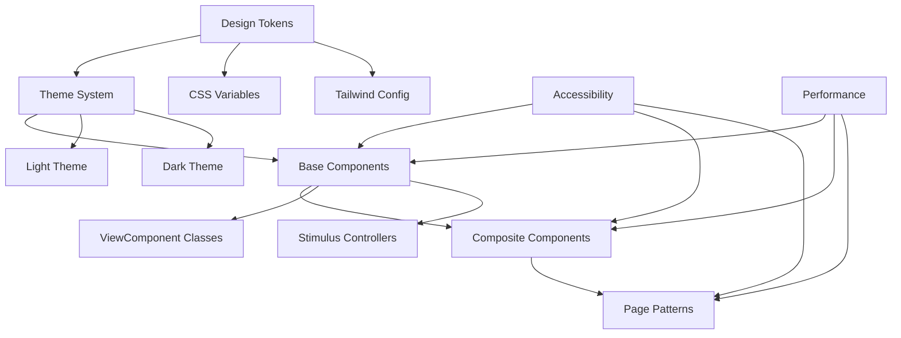

# Developer Onboarding Guide

This guide provides a comprehensive introduction to the Maybe Finance design system for new developers joining the project. It covers the essential concepts, tools, and best practices for working with our UI components.

## Getting Started

### Prerequisites

Before you begin working with the Maybe Finance design system, ensure you have:

1. Set up your development environment following the instructions in the main README
2. Familiarized yourself with the core technologies:
   - Ruby on Rails 7.2.2
   - ViewComponent
   - Tailwind CSS
   - Stimulus
   - Lookbook

### Initial Setup

1. Clone the repository and install dependencies:
   ```bash
   git clone [repository-url]
   cd maybe-finance
   bin/setup
   ```

2. Start the development server:
   ```bash
   bin/dev
   ```

3. Access the component documentation:
   ```
   http://localhost:3000/lookbook
   ```

4. Explore the theme test page:
   ```
   http://localhost:3000/theme-test.html
   ```

## Design System Architecture

The Maybe Finance design system follows a layered architecture:



### Key Concepts

1. **Design Tokens**: Foundational visual elements like colors, typography, spacing
2. **Theme System**: Light/dark mode implementation with CSS variables
3. **Component Library**: Reusable UI components built with ViewComponent
4. **Layout Patterns**: Common page structures and grid systems
5. **Form Patterns**: Standardized form implementations

## Component System Overview

### Component Namespaces

The design system uses the following namespaces:

- **Ui**: Modern Shadcn-inspired components (`Ui::ButtonComponent`)
- **Root**: Legacy components being phased out (`ButtonComponent`)

Always use the `Ui` namespace for new development.

### Component Categories

Components are organized into the following categories:

1. **Core Components**: Fundamental building blocks (Button, Card, Alert)
2. **Form Components**: Input and form-related components (Input, Select, Checkbox)
3. **Navigation Components**: Components for navigation (Tabs, Menu, Pagination)
4. **Feedback Components**: Components for user feedback (Dialog, Toast, Spinner)
5. **Data Display Components**: Components for displaying data (Table, List, Chart)
6. **Financial Components**: Domain-specific components (AccountCard, TransactionItem)

### Component Structure

Each component in our system typically consists of:

1. **Ruby Class**: `app/components/ui/button_component.rb`
2. **ERB Template**: `app/components/ui/button_component.html.erb`
3. **Stimulus Controller** (if interactive): `app/javascript/controllers/ui/button_controller.js`
4. **Tests**: `test/components/ui/button_component_test.rb`
5. **Preview**: `app/components/previews/ui/button_component_preview.rb`

## Working with Components

### Using Existing Components

To use an existing component in your views:

```erb
<%= render Ui::ButtonComponent.new(variant: :primary) do %>
  Click Me
<% end %>
```

For components with slots:

```erb
<%= render Ui::CardComponent.new do |c| %>
  <% c.with_header do %>
    Card Header
  <% end %>
  
  <% c.with_content do %>
    Card Content
  <% end %>
  
  <% c.with_footer do %>
    Card Footer
  <% end %>
<% end %>
```

For components with collections:

```erb
<%= render Ui::SelectComponent.new(name: "country") do |s| %>
  <% s.with_option(value: "US") { "United States" } %>
  <% s.with_option(value: "CA") { "Canada" } %>
  <% s.with_option(value: "UK") { "United Kingdom" } %>
<% end %>
```

### Creating New Components

To create a new component:

1. Generate the component files:
   ```bash
   rails generate component Ui::Example
   ```

2. Define the component class:
   ```ruby
   # app/components/ui/example_component.rb
   module Ui
     class ExampleComponent < ViewComponent::Base
       def initialize(**options)
         @options = options
       end
       
       private
       
       def css_classes
         [
           "base-classes",
           @options[:class]
         ].compact.join(" ")
       end
     end
   end
   ```

3. Create the template:
   ```erb
   <%# app/components/ui/example_component.html.erb %>
   <div class="<%= css_classes %>" <%= @options.except(:class) %>>
     <%= content %>
   </div>
   ```

4. Add tests:
   ```ruby
   # test/components/ui/example_component_test.rb
   require "test_helper"
   
   class Ui::ExampleComponentTest < ViewComponent::TestCase
     test "renders component" do
       render_inline(Ui::ExampleComponent.new) { "Content" }
       
       assert_text "Content"
     end
     
     test "renders with custom class" do
       render_inline(Ui::ExampleComponent.new(class: "custom-class")) { "Content" }
       
       assert_selector ".custom-class", text: "Content"
     end
   end
   ```

5. Document in Lookbook:
   ```ruby
   # app/components/previews/ui/example_component_preview.rb
   module Ui
     class ExampleComponentPreview < ViewComponent::Preview
       def default
         render(ExampleComponent.new) { "Example Content" }
       end
       
       def with_options
         render(ExampleComponent.new(class: "custom-class")) { "With Options" }
       end
       
       # Show in both themes
       def theme_comparison
         render_with_template(
           template: "ui/previews/theme_comparison",
           locals: {
             component: ExampleComponent.new,
             content: "Theme Comparison"
           }
         )
       end
     end
   end
   ```

6. Create a Stimulus controller (if needed):
   ```javascript
   // app/javascript/controllers/ui/example_controller.js
   import { Controller } from "@hotwired/stimulus"
   
   export default class extends Controller {
     static targets = ["content"]
     
     connect() {
       console.log("Example controller connected")
     }
     
     toggle() {
       this.contentTarget.classList.toggle("hidden")
     }
   }
   ```

## Theme System

### Theme Architecture

The theme system uses CSS variables and data attributes:

```css
:root {
  /* Light theme defaults */
  --background: 210 40% 98%;
  --foreground: 224 71% 4%;
  /* Other variables */
}

[data-theme="dark"] {
  /* Dark theme overrides */
  --background: 224 71% 4%;
  --foreground: 210 40% 98%;
  /* Other variables */
}
```

### Using Theme Variables

Always use theme variables instead of hardcoded colors:

```css
/* Good */
.element {
  background-color: hsl(var(--background));
  color: hsl(var(--foreground));
}

/* Avoid */
.element {
  background-color: white;
  color: black;
}
```

### Theme-Aware Tailwind Classes

Use Tailwind's theme-aware classes:

```html
<!-- Good -->
<div class="bg-background text-foreground">
  Theme-aware content
</div>

<!-- Avoid -->
<div class="bg-white text-black">
  Hardcoded colors
</div>
```

### Theme Switching

The theme can be switched using the `ThemeController`:

```erb
<div data-controller="theme">
  <button data-action="theme#toggle">Toggle Theme</button>
  <button data-action="theme#setLight">Light</button>
  <button data-action="theme#setDark">Dark</button>
  <button data-action="theme#setSystem">System</button>
</div>
```

### Testing in Both Themes

Always test your components in both light and dark themes:

1. Use the theme toggle in the development environment
2. Check for any hardcoded colors or inconsistencies
3. Verify proper contrast ratios in both themes
4. Use the theme test page at `/theme-test.html`

## Accessibility Implementation

When working with the design system, follow these accessibility guidelines:

### Semantic HTML

Use the appropriate HTML elements for their intended purpose:

```html
<!-- Good -->
<button type="button">Click Me</button>

<!-- Avoid -->
<div onclick="handleClick()">Click Me</div>
```

### Keyboard Navigation

Ensure all interactive elements are keyboard accessible:

```javascript
// In Stimulus controller
handleKeydown(event) {
  if (event.key === "Enter" || event.key === " ") {
    this.activate()
    event.preventDefault()
  }
}
```

### ARIA Attributes

Use ARIA attributes when necessary, but prefer semantic HTML:

```html
<!-- Good -->
<button aria-expanded="false" aria-controls="dropdown">Menu</button>
<div id="dropdown" hidden>Dropdown content</div>

<!-- Avoid -->
<div role="button" tabindex="0">Menu</div>
```

### Color Contrast

Maintain a minimum contrast ratio of 4.5:1 for normal text:

```css
/* Good - High contrast */
.text-primary {
  color: hsl(var(--primary));
}

/* Avoid - Low contrast */
.text-muted {
  color: #999; /* Hardcoded low contrast color */
}
```

### Focus Management

Implement proper focus management for interactive components:

```javascript
// In Dialog controller
open() {
  this.dialogTarget.showModal()
  
  // Focus first focusable element
  const focusable = this.contentTarget.querySelectorAll(
    'button, [href], input, select, textarea, [tabindex]:not([tabindex="-1"])'
  )
  if (focusable.length) focusable[0].focus()
}

close() {
  this.dialogTarget.close()
  
  // Return focus to trigger element
  if (this.triggerElement) {
    this.triggerElement.focus()
  }
}
```

## Common Implementation Patterns

### Page Layout

Standard page layout structure:

```erb
<%= render Ui::PageLayoutComponent.new do |p| %>
  <% p.with_header do %>
    <h1 class="text-2xl font-bold">Page Title</h1>
  <% end %>
  
  <% p.with_content do %>
    <div class="grid gap-6 md:grid-cols-2 lg:grid-cols-3">
      <!-- Content -->
    </div>
  <% end %>
<% end %>
```

### Form Structure

Standard form implementation:

```erb
<%= render Ui::FormComponent.new(model: @user) do |f| %>
  <% f.with_field do %>
    <%= render Ui::InputComponent.new(
      label: "Name",
      name: "user[name]",
      value: @user.name,
      error: @user.errors[:name].first,
      required: true
    ) %>
  <% end %>
  
  <% f.with_field do %>
    <%= render Ui::InputComponent.new(
      type: :email,
      label: "Email",
      name: "user[email]",
      value: @user.email,
      error: @user.errors[:email].first,
      required: true
    ) %>
  <% end %>
  
  <% f.with_actions do %>
    <%= render Ui::ButtonComponent.new(variant: :outline, href: users_path) do %>
      Cancel
    <% end %>
    
    <%= render Ui::ButtonComponent.new(variant: :primary, type: :submit) do %>
      Save
    <% end %>
  <% end %>
<% end %>
```

### Data Display

Standard data table implementation:

```erb
<%= render Ui::TableComponent.new do |t| %>
  <% t.with_header do %>
    <tr>
      <th class="p-4 text-left">Name</th>
      <th class="p-4 text-left">Email</th>
      <th class="p-4 text-right">Actions</th>
    </tr>
  <% end %>
  
  <% t.with_body do %>
    <% @users.each do |user| %>
      <tr class="border-t border-border">
        <td class="p-4"><%= user.name %></td>
        <td class="p-4"><%= user.email %></td>
        <td class="p-4 text-right">
          <%= render Ui::ButtonComponent.new(variant: :ghost, size: :sm) do %>
            Edit
          <% end %>
        </td>
      </tr>
    <% end %>
  <% end %>
<% end %>
```

### Card Layout

Standard card implementation:

```erb
<%= render Ui::CardComponent.new do |c| %>
  <% c.with_header do %>
    <h3 class="text-lg font-medium">Card Title</h3>
    <p class="text-sm text-muted-foreground">Card subtitle</p>
  <% end %>
  
  <% c.with_content do %>
    <p>This is the main content of the card.</p>
  <% end %>
  
  <% c.with_footer do %>
    <div class="flex justify-end space-x-2">
      <%= render Ui::ButtonComponent.new(variant: :outline) do %>
        Cancel
      <% end %>
      
      <%= render Ui::ButtonComponent.new(variant: :primary) do %>
        Save
      <% end %>
    </div>
  <% end %>
<% end %>
```

### Dialog Implementation

Standard dialog implementation:

```erb
<%= render Ui::DialogComponent.new(
  id: "example-dialog",
  title: "Dialog Title",
  data: { controller: "ui--dialog" }
) do |d| %>
  <% d.with_content do %>
    <p>This is the dialog content.</p>
  <% end %>
  
  <% d.with_footer do %>
    <div class="flex justify-end space-x-2">
      <%= render Ui::ButtonComponent.new(
        variant: :outline,
        data: { action: "ui--dialog#close" }
      ) do %>
        Cancel
      <% end %>
      
      <%= render Ui::ButtonComponent.new(variant: :primary) do %>
        Confirm
      <% end %>
    </div>
  <% end %>
<% end %>

<!-- Trigger button -->
<%= render Ui::ButtonComponent.new(
  data: { action: "click->ui--dialog#open" }
) do %>
  Open Dialog
<% end %>
```

## Testing Components

### Unit Testing

```ruby
# test/components/ui/button_component_test.rb
require "test_helper"

class Ui::ButtonComponentTest < ViewComponent::TestCase
  test "renders button with default variant" do
    render_inline(Ui::ButtonComponent.new) { "Click me" }
    
    assert_selector "button.bg-primary", text: "Click me"
  end
  
  test "renders button with custom variant" do
    render_inline(Ui::ButtonComponent.new(variant: :secondary)) { "Secondary" }
    
    assert_selector "button.bg-secondary", text: "Secondary"
  end
  
  test "renders as link when href is provided" do
    render_inline(Ui::ButtonComponent.new(href: "/path")) { "Link Button" }
    
    assert_selector "a[href='/path']", text: "Link Button"
  end
end
```

### Theme Testing

```ruby
# test/components/ui/theme_test.rb
require "test_helper"

class ThemeTest < ViewComponent::TestCase
  include ThemeTestHelper
  
  test "component renders correctly in light theme" do
    with_theme(:light) do
      render_inline(Ui::CardComponent.new) { "Content" }
      
      assert_selector ".bg-card", text: "Content"
      # Additional light theme assertions
    end
  end
  
  test "component renders correctly in dark theme" do
    with_theme(:dark) do
      render_inline(Ui::CardComponent.new) { "Content" }
      
      assert_selector ".bg-card", text: "Content"
      # Additional dark theme assertions
    end
  end
end
```

### Accessibility Testing

```ruby
# test/components/ui/accessibility_test.rb
require "test_helper"

class AccessibilityTest < ViewComponent::TestCase
  include AccessibilityTestHelper
  
  test "button has accessible name" do
    render_inline(Ui::ButtonComponent.new(aria: { label: "Close" }))
    
    assert_selector "button[aria-label='Close']"
  end
  
  test "dialog has proper ARIA attributes" do
    render_inline(Ui::DialogComponent.new(id: "test-dialog", title: "Dialog Title"))
    
    assert_selector "dialog[aria-labelledby]"
    assert_selector "h2#test-dialog-title", text: "Dialog Title"
  end
end
```

## Performance Optimization

### Component Optimization

1. **Minimize DOM Updates**: Avoid unnecessary DOM updates
2. **Use Lazy Loading**: Load components only when needed
3. **Optimize Rendering**: Use efficient rendering techniques
4. **Reduce Bundle Size**: Keep component code minimal

### Example: Lazy Loading

```ruby
# app/components/ui/lazy_component.rb
module Ui
  class LazyComponent < ViewComponent::Base
    def initialize(component:, **options)
      @component = component
      @options = options
    end
    
    def call
      content_tag(:div, "", 
        data: {
          controller: "lazy-load",
          lazy_load_component_value: @component,
          lazy_load_options_value: @options.to_json
        },
        class: "min-h-[100px]"
      )
    end
  end
end
```

## Troubleshooting

### Common Issues

1. **Theme inconsistencies**: Check for hardcoded colors or missing theme variables
2. **Component rendering issues**: Verify props and content are passed correctly
3. **Stimulus controller not connecting**: Check data-controller attribute and controller registration
4. **CSS conflicts**: Look for global styles overriding component styles
5. **Slot rendering issues**: Ensure slots are properly defined and used

### Debugging Tools

1. **Lookbook**: Use the component explorer to isolate and test components
2. **Browser DevTools**: Inspect elements to check applied styles and theme variables
3. **Rails Logs**: Check for component rendering errors
4. **Stimulus Debug**: Use `stimulus:debug` in the browser console
5. **Theme Test Page**: Use `/theme-test.html` to test components in both themes

### Common Error Messages

| Error Message | Possible Cause | Solution |
|---------------|----------------|----------|
| `undefined method 'with_*' for #<Component>` | Missing slot definition | Add `renders_one :slot_name` to component class |
| `No template found for ComponentName` | Missing template file | Create the .html.erb template file |
| `undefined method 'render_inline'` | Missing test helper | Include `require "view_component/test_case"` |
| `Stimulus controller "x" cannot be found` | Controller not registered | Check controller path and registration |
| `Cannot read properties of undefined` | JavaScript error in Stimulus | Check browser console for details |

## Design System Tools

### Lookbook

Lookbook is a component development environment that allows you to:

1. Browse all components
2. View component documentation
3. Interact with component examples
4. Test components in isolation

Access Lookbook at `http://localhost:3000/lookbook` in development.

### Theme Test Page

The theme test page allows you to:

1. View all components in both light and dark themes
2. Test theme switching
3. Verify theme consistency

Access the theme test page at `http://localhost:3000/theme-test.html` in development.

### Visual Regression Testing

Visual regression testing helps catch unintended visual changes:

1. Run visual regression tests: `rails test:visual`
2. Review visual diffs in the `tmp/visual_regression` directory
3. Update snapshots if changes are intentional: `rails test:visual:approve`

## Resources

- [ViewComponent Documentation](https://viewcomponent.org/)
- [Tailwind CSS Documentation](https://tailwindcss.com/docs)
- [Stimulus Handbook](https://stimulus.hotwired.dev/handbook/introduction)
- [WCAG 2.1 Guidelines](https://www.w3.org/TR/WCAG21/)
- [Shadcn UI](https://ui.shadcn.com/) (inspiration for our design system)
- [Radix UI](https://www.radix-ui.com/) (accessibility patterns)

## Getting Help

If you encounter issues or have questions about the design system:

1. Check the existing documentation
2. Review component tests for expected behavior
3. Ask in the #design-system Slack channel
4. Open an issue in the repository with a detailed description
5. Consult the [Implementation Patterns](./implementation-patterns.md) guide for common patterns